# Deploying a Web Application on EC2 Step by Step

### Step 1: Navigate to EC2 Dashboard
In the AWS Management Console, type "EC2" in the search bar and select "EC2" from the dropdown menu.  
This will take you to EC2 Dashboard

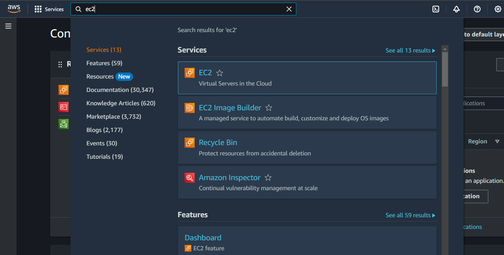

### Step 2: Click on launch instance
  
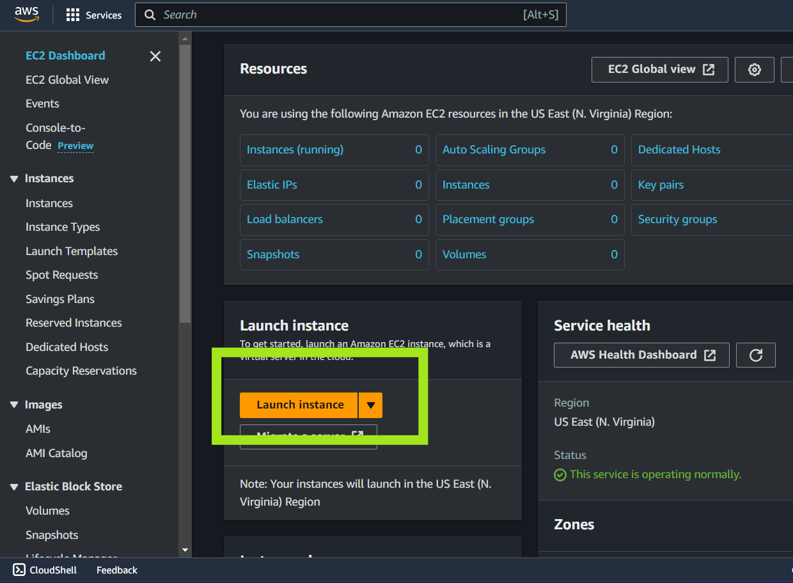

### Step 3: Configure the Instance

#### 3.1 Select Name
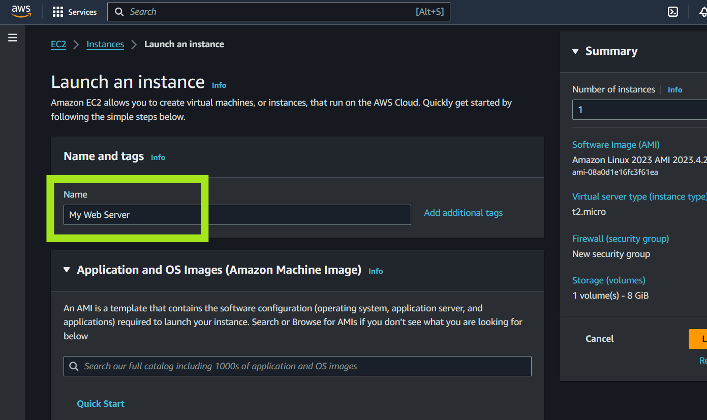

#### 3.2 Choose Amazon Machine Image 
For our purpose, we can use the Ubuntu Server  

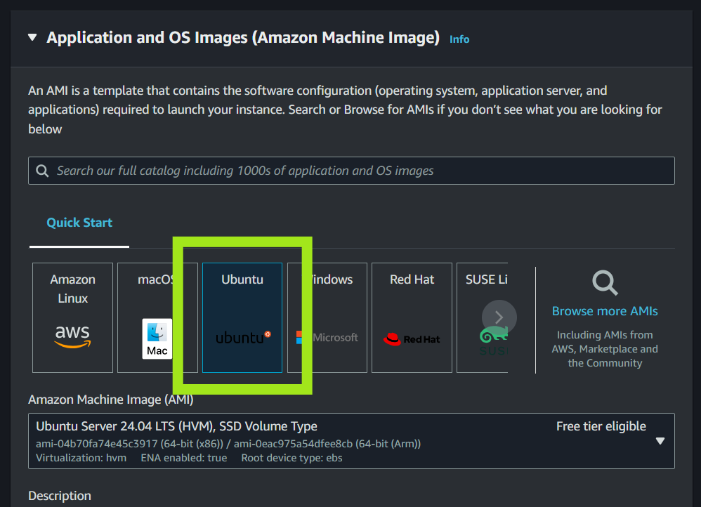

#### 3.3 Choose an Instance type
Select the "t2.micro" instance type.  

This instance type is part of the free tier for eligible users, offering 750 hours per month for the first 12 months.  

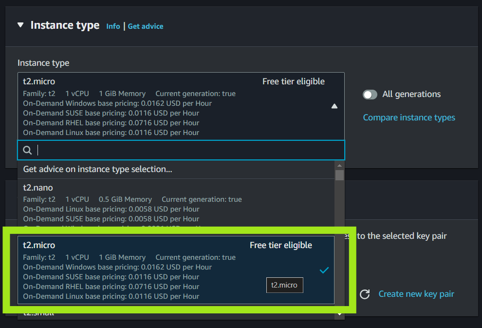

#### 3.4 Select a Key Pair
You need a key pair to SSH into your instance.  

If you already have a key pair, select it. If not, create a new key pair and download it (.pem file). Keep this file secure as you’ll need it to access your instance.

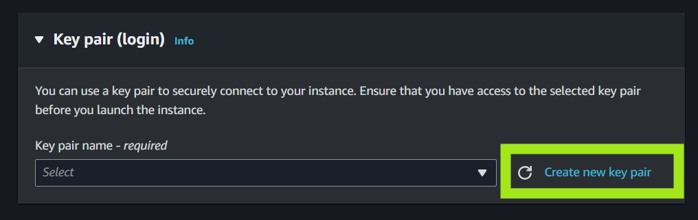

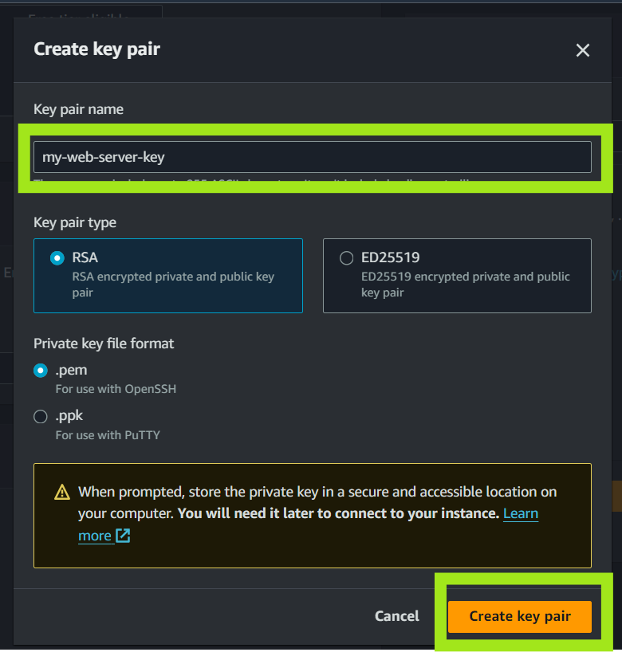

#### 3.5 Configure Security Group
A security group acts as a virtual firewall to control inbound and outbound traffic.
Create a new security group with following rules.

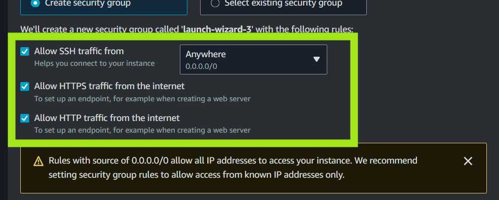

#### 3.6 Launch Instance
Click on launch instance

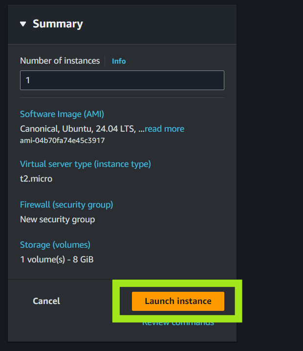


### Step 4: Connect to EC2 instance using EC2 Instance Connect

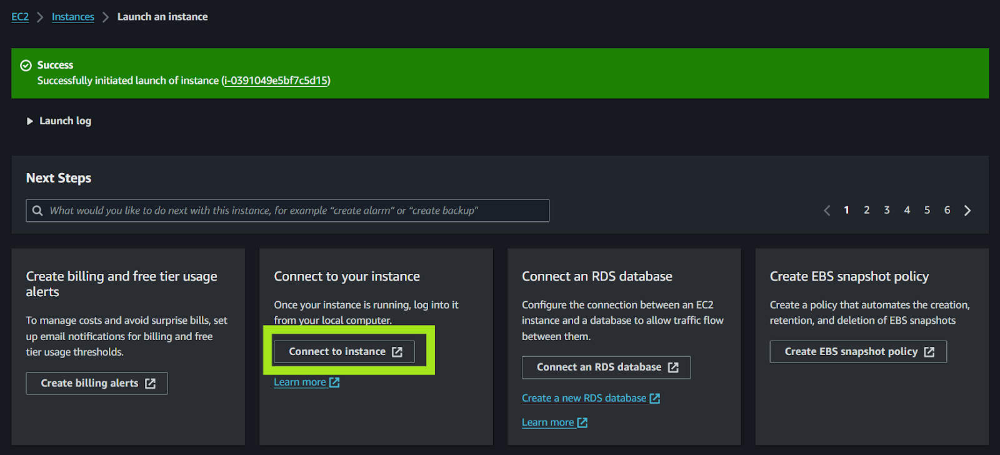

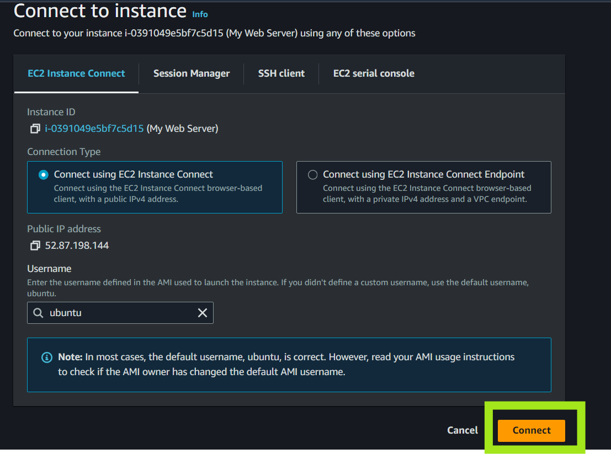

This should connect you to the virtual machine.

You can also connect to the instance using the ssh key we generated earlier (Optional)

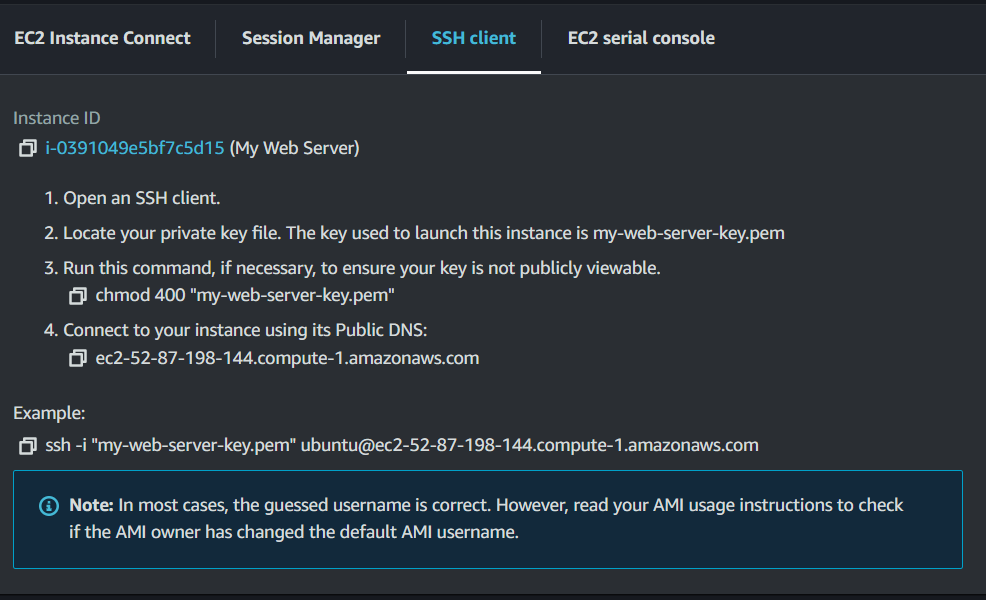

### Step 5: Update package list and setup NGINX

#### 1. Update Package List

```bash
sudo apt update
sudo apt upgrade
```


#### 2: Set Up a Reverse Proxy with Nginx

A __reverse proxy__ is a server that __sits between client devices and web servers__, forwarding client requests to the appropriate server. 

When a client sends a request to a website, the reverse proxy __intercepts__ this request and forwards it to the backend server (in this case, the Node.js application running on port 3000). 

The backend server processes the request and sends the response back to the reverse proxy, which then forwards it to the client.

Why a reverse proxy is commonly used and why the Node.js application was not directly run on ports 80 or 443:

1. On many operating systems, binding to ports below 1024 (such as 80 and 443) requires elevated privileges (root access)
2. A reverse proxy can distribute incoming requests across multiple instances of the Node.js application, improving load balancing and allowing the system to scale horizontally
3. Running the application behind a reverse proxy helps isolate it from direct exposure to the internet. This provides an additional layer of security.

A reverse proxy like Nginx or Apache is more efficient at handling a large number of incoming requests, static content, and SSL/TLS encryption.

In this tutorial, I'll use `Nginx` for reverse proxy
  
#### 2.1. Install Nginx
```bash
sudo apt install nginx
```

#### 2.2. Start and Enable Nginx
```bash
sudo systemctl start nginx
sudo systemctl enable nginx
```

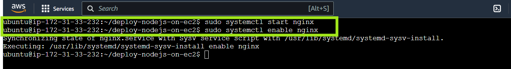


#### 2.3. Verify that Nginx is installed

Go to the VM's public IP Address. You can find that in `network` of the instance dashboard

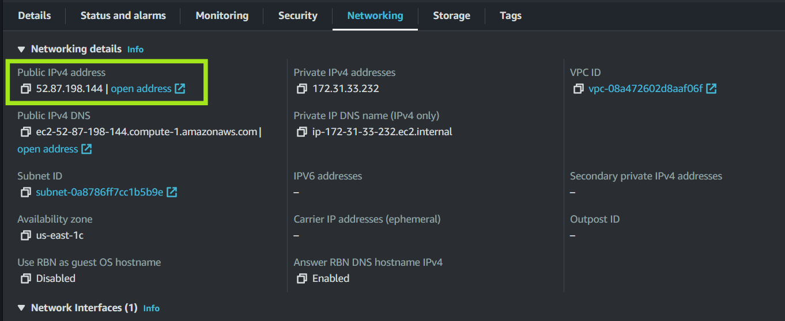

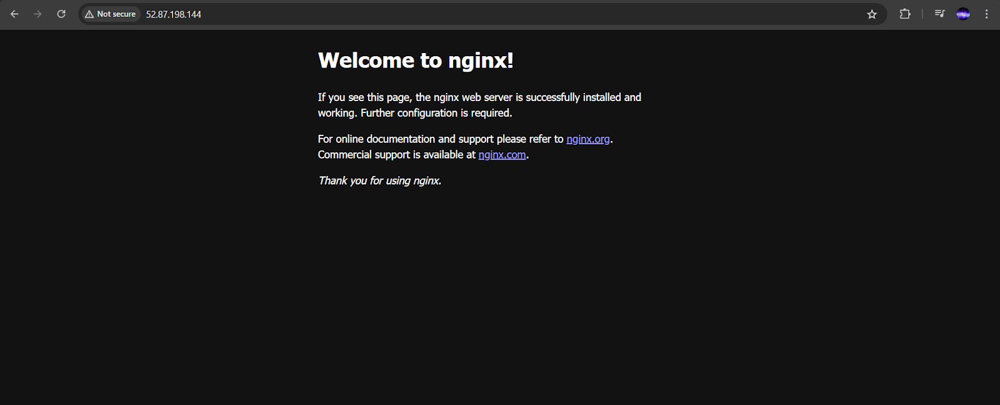


If you see this, it means that nginx is installed correctly
--- 

### Step 6: Setting up Flask Server

#### 1. Setup Python Environment
You need to install Python, Package Manager, Virtual Environment to run our application. If you are running a different application, install respective dependency

```bash
sudo apt install python3
sudo apt install python-is-python3
sudo apt install pip
sudo apt install python3.12-venv
```

#### 2. Transfer the project files
In this step, you need to transfer all the project files using either git or scp or any other mechanism

For this example, I'll use git


You need to install git to bring your files into virtual machine.

```bash
sudo apt install git -y
```

Navigate to the directory where you want to clone your project. For example, your home directory:

```bash
cd ~
```

Clone your repository

```bash
git clone https://github.com/tirthraj07/AWS-Cloud-Challenge.git
```


### Step 7: Install project dependencies

#### 1. Navigate to your Project Directory
```bash
cd your-repo-name
cd flask-todo
```

#### 2. Install Project Dependencies

Install SQLite for this project

```bash
sudo apt install sqlite3
sqlite3 --version
```

Create a python virtual environment

```bash
python -m venv my_env
source my_env/bin/activate
```

Install dependencies

```bash
pip install -r requirements.txt
```

Deactivate from virtual environment

```bash
deactivate
```

### Step 8: Run Server in Background

__Tmux__ (short for Terminal Multiplexer) is a powerful command-line tool that allows you to manage multiple terminal sessions within a single window. It is particularly useful for:

Running long-running processes (e.g., servers) in the background.

Detaching and reattaching to terminal sessions, even after disconnecting from a remote server.

Splitting the terminal window into multiple panes for multitasking.

Tmux is widely used by developers and system administrators to manage workflows on remote servers or for running processes that need to persist even after closing the terminal.


#### 1. Create a new tmux session
```bash
tmux new -s mysession
```

#### 2. Start Flask Server using Gunicorn
```bash
source my_env/bin/activate

gunicorn -w 3 app:app --bind 0.0.0.0:8080
```

#### 3. Detach from the session
Press `Ctrl + b` and `d` (detach)

#### 4. Check if server is running in background

```bash
ps aux | grep 'python'
```

Example Output

```bash
ubuntu     11303  0.7  2.4  34252 24448 pts/1    S+   22:02   0:00 /home/ubuntu/flask-todo/my_env/bin/python /home/ubuntu/flask-todo/my_env/bin/gunicorn -w 3 app:app --bind 0.0.0.0:8080
ubuntu     11304  2.6  5.2  66372 51552 pts/1    S+   22:02   0:00 /home/ubuntu/flask-todo/my_env/bin/python /home/ubuntu/flask-todo/my_env/bin/gunicorn -w 3 app:app --bind 0.0.0.0:8080
ubuntu     11305  2.6  5.2  66372 51552 pts/1    S+   22:02   0:00 /home/ubuntu/flask-todo/my_env/bin/python /home/ubuntu/flask-todo/my_env/bin/gunicorn -w 3 app:app --bind 0.0.0.0:8080
ubuntu     11306  2.6  5.2  66404 51552 pts/1    S+   22:02   0:00 /home/ubuntu/flask-todo/my_env/bin/python /home/ubuntu/flask-todo/my_env/bin/gunicorn -w 3 app:app --bind 0.0.0.0:8080
```

#### 5. Optionally to reattach to the session to check for logs
```bash
tmux attach -t mysession
```

---
### Step 9. Configure Nginx as a Reverse Proxy
Since our python application is bound to port `8080`, we need to forward all request from port `80` to port `8080`. To do so, we need to change the Nginx Configuration file.

#### 1. Rename the default configuration file
```bash
sudo mv /etc/nginx/sites-available/default /etc/nginx/sites-available/default-demo
```

#### 2. Create a new default configuration file and copy the following

```bash
sudo touch /etc/nginx/sites-available/default
sudo nano /etc/nginx/sites-available/default
```

```bash
server {
    listen 80;
    server_name your_domain_or_IP;

    location / {
        proxy_pass http://localhost:8080;
        proxy_http_version 1.1;
        proxy_set_header Upgrade $http_upgrade;
        proxy_set_header Connection 'upgrade';
        proxy_set_header Host $host;
        proxy_cache_bypass $http_upgrade;
    }
}
```
Replace the `your_domain_or_IP` with the public IPv4 address and proxy pass to localhost:8080 where our flask app is running.

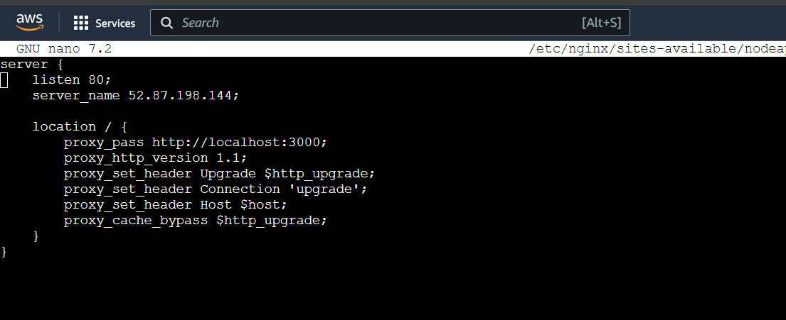


Test the Nginx configuration for syntax errors:
```bash
sudo nginx -t
```

If there are no errors, restart Nginx to apply the changes:
```bash
sudo systemctl restart nginx
```

#### 6. Optionally Adjust Firewall Rules
Ensure that your firewall allows HTTPS traffic:
```bash 
sudo ufw allow 'Nginx Full'
```  
   
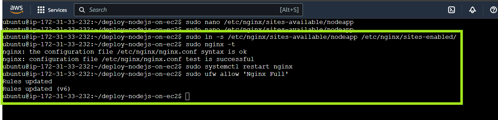


#### 7. Verify the setup

Open your web browser and navigate to `http://IP`. 
You should see your Flask application, indicating that Nginx is successfully proxying requests to your application running on port 8080.

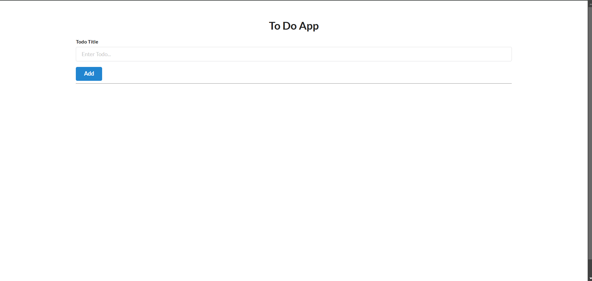


--- 

### Step 10: Obtain SSL/TLS Certificate (Optional Step)

You need to obtain a SSL/TLS Certificate inorder to use HTTPS instead of HTTP.

Also we need to configure nginx such that, if the user visits __http__ then they should be redirect to __https__

There are two approaches:
1. __Using Let's Encrypt with a Domain Name__
2. __Creating a Self-Signed Certificate__

### 11.1 Using Let's Encrypt with a Domain Name
For this step, you require a domain name because many Certificate Authorities, including `Let's Encrypt`, prefer or require a domain name to issue SSL/TLS certificates

#### 1. Purchase a Domain Name: 
You can buy a domain name from registrars like Namecheap, GoDaddy, or Google Domains

#### 2. Point the Domain to Your Server:
Set up an A record in your domain's DNS settings to point to your server's IP address. You can do this using __Amazon Route 53__

#### 3. Complete the Configuration:

##### 1. Install Certbot and the Nginx plugin
Certbot will help you obtain and manage SSL/TLS certificates from Let's Encrypt:

```bash
sudo apt install certbot python3-certbot-nginx
```

##### 2. Obtain an SSL/TLS Certificate
Obtain an SSL/TLS Certificate

```bash 
sudo certbot --nginx -d your_domain_or_IP
```

##### 3. Configure Nginx to Redirect HTTP to HTTPS
Open the Nginx configuration file for your site:

```bash
sudo nano /etc/nginx/sites-available/nodeapp
```

Modify the configuration to include both the HTTP to HTTPS redirect and the HTTPS server block. Your updated configuration should look like this:

```bash
server {
    listen 80;
    server_name your_domain_or_IP;

    # Redirect all HTTP requests to HTTPS
    return 301 https://$host$request_uri;
}

server {
    listen 443 ssl;
    server_name your_domain_or_IP;

    ssl_certificate /etc/letsencrypt/live/your_domain_or_IP/fullchain.pem;
    ssl_certificate_key /etc/letsencrypt/live/your_domain_or_IP/privkey.pem;
    include /etc/letsencrypt/options-ssl-nginx.conf;
    ssl_dhparam /etc/letsencrypt/ssl-dhparams.pem;

    location / {
        proxy_pass http://localhost:3000;
        proxy_http_version 1.1;
        proxy_set_header Upgrade $http_upgrade;
        proxy_set_header Connection 'upgrade';
        proxy_set_header Host $host;
        proxy_cache_bypass $http_upgrade;
    }
}
```
Make sure to replace `your_domain_or_IP` with your actual domain name or IP address

##### 4. Enable the Configuration and Restart Nginx

```bash
sudo ln -s /etc/nginx/sites-available/nodeapp /etc/nginx/sites-enabled/
```

##### 5. Test the Nginx configuration

```bash
sudo nginx -t
```

##### 6. If there are no errors, restart Nginx to apply the changes:
```bash
sudo systemctl restart nginx
```

##### 7. Adjust Firewall Rules (if necessary)
```bash
sudo ufw allow 'Nginx Full'
```

##### 8. Verify the setup
Open your web browser and navigate to `http://your_domain`. You should be automatically redirected to `https://your_domain` and see your __Node.js application served securely__.

---

### 11.2 Creating a Self-Signed Certificate

#### 1. Generate a Self-Signed Certificate:
```bash
sudo openssl req -x509 -nodes -days 365 -newkey rsa:2048 -keyout /etc/ssl/private/nginx-selfsigned.key -out /etc/ssl/certs/nginx-selfsigned.crt
```
  
#### 2. Create a Strong Diffie-Hellman Group:
```bash
sudo openssl dhparam -out /etc/ssl/certs/dhparam.pem 2048
```
  
#### 3. Configure Nginx for the Self-Signed Certificate:

Create a new configuration file:

```bash
sudo nano /etc/nginx/snippets/self-signed.conf
```

Add the following configuration:

```bash
ssl_certificate /etc/ssl/certs/nginx-selfsigned.crt;
ssl_certificate_key /etc/ssl/private/nginx-selfsigned.key;
```

Create another configuration file for SSL settings:

```bash
sudo nano /etc/nginx/snippets/ssl-params.conf
```

Add the following configuration:

```nginx
ssl_protocols TLSv1.2;
ssl_prefer_server_ciphers on;
ssl_dhparam /etc/ssl/certs/dhparam.pem;
ssl_ciphers 'ECDHE-RSA-AES256-GCM-SHA384:ECDHE-RSA-AES128-GCM-SHA256:ECDHE-RSA-AES256-SHA384:ECDHE-RSA-AES128-SHA256'; # Example cipher suite, adjust as necessary
ssl_ecdh_curve secp384r1;
ssl_session_timeout 10m;
ssl_session_cache shared:SSL:10m;
ssl_stapling on;
ssl_stapling_verify on;
resolver 8.8.8.8 8.8.4.4 valid=300s;
resolver_timeout 5s;
add_header Strict-Transport-Security "max-age=63072000; includeSubDomains; preload" always;
add_header X-Frame-Options DENY;
add_header X-Content-Type-Options nosniff;
```

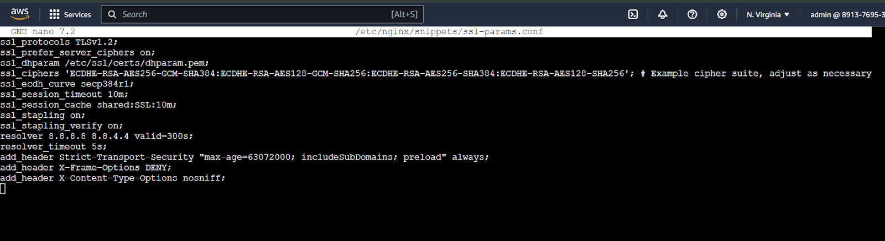

#### 4. Modify the Nginx Configuration File:

Edit your site configuration:

```bash
sudo nano /etc/nginx/sites-available/default
```

Update it to use the self-signed certificate:

```nginx
server {
    listen 80;
    server_name public_ip_addr;

    return 301 https://$host$request_uri;
}

server {
    listen 443 ssl;
    server_name public_ip_addr;

    include snippets/self-signed.conf;
    include snippets/ssl-params.conf;

    location / {
        proxy_pass http://localhost:8080;
        proxy_http_version 1.1;
        proxy_set_header Upgrade $http_upgrade;
        proxy_set_header Connection 'upgrade';
        proxy_set_header Host $host;
        proxy_cache_bypass $http_upgrade;
    }
}
```

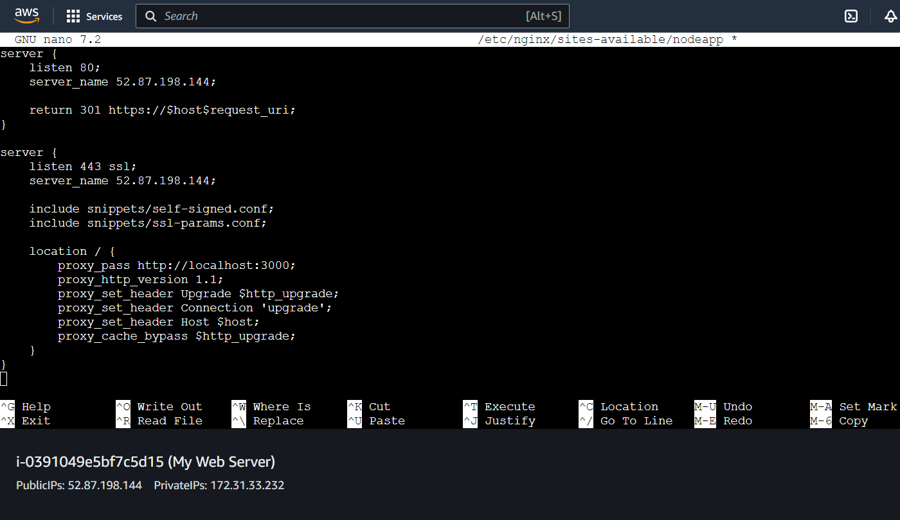

#### 5. Test and Restart Nginx:

```bash
sudo nginx -t
sudo systemctl restart nginx
```

#### 6. Adjust Firewall Rules (if necessary)
Ensure that your firewall allows HTTPS traffic:

```bash
sudo ufw allow 'Nginx Full'
```

#### 7. Verification
Open your web browser and navigate to `http://your_ip_address`. You should be automatically redirected to `https://your_ip_address`, and your Application should be served securely. 


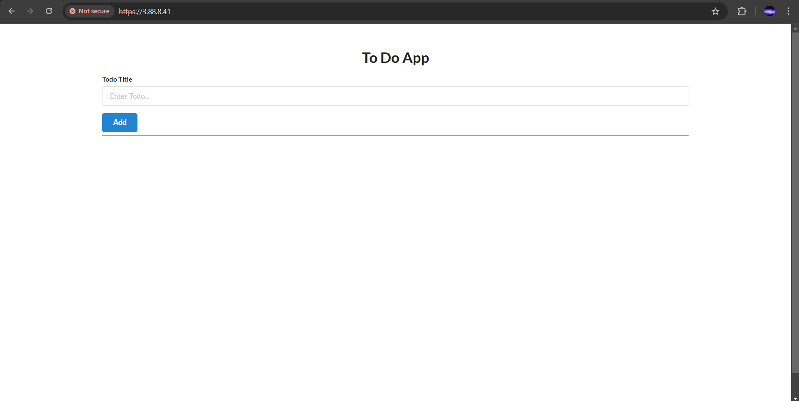

 
> Note that with a self-signed certificate, you'll receive a browser warning about the certificate not being trusted. This is normal and expected.
> If you prefer to avoid browser warnings, consider obtaining a domain name and using Let's Encrypt to obtain a free, trusted SSL certificate.


---

There you go! You have successfully deployed your project on __AWS EC2 Instance__ with __NGINX__ AND __SSL__